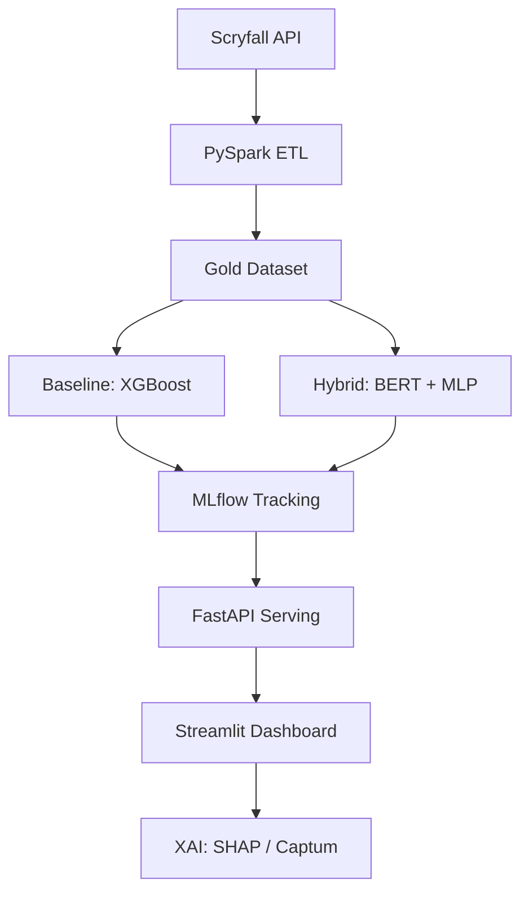
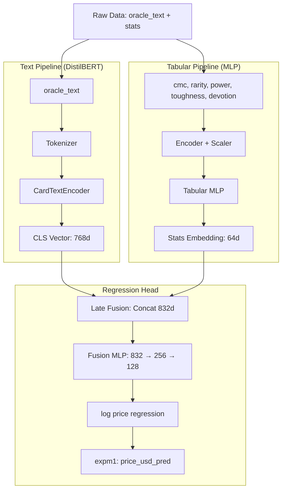

# 🔮 ManaMetrics: The Hybrid Asset Valuator

[](https://www.python.org/downloads/)
[](https://mlflow.org/)
[](https://pytorch.org/)

**ManaMetrics** is a high-end AI showcase designed to predict the market value of Magic: The Gathering assets. It leverages a multi-modal architecture combining tabular data (game statistics) and semantic rule text via Deep Learning.

## 🚀 Key Features

- **Multi-Modal AI**: Fusion of Transformer-based NLP (BERT) for rule text and Multi-Layer Perceptrons for game stats.
- **Big Data Engineering**: Scalable ETL pipeline powered by **PySpark**.
- **Explainable AI (XAI)**: Dedicated interpretability module with **SHAP** analysis and feature importance visualization.
- **Full MLOps Lifecycle**: Experiment tracking with **MLflow** and data versioning with **DVC**.
- **Interactive Showroom**: Real-time price inference via a **Streamlit** dashboard.

## 🏗️ Architecture



## 🛠️ Tech Stack

- **Core**: Python 3.11, PySpark
- **Modeling**: PyTorch (Lightning), Transformers, Scikit-Learn, XGBoost
- **XAI**: SHAP, Captum
- **MLOps**: MLflow, DVC, Docker
- **Interface**: FastAPI, Streamlit

## 📁 Project Structure

- `data/`: Raw and processed datasets.
- `models/`: Saved model binaries, weights, and SHAP analysis.
- `src/`: Modular source code
  - `data/`: ETL pipeline and API clients
  - `models/`: Model architectures, training scripts, and interpretability
- `tests/`: Automated unit and functional tests.
- `manametrics.sh`: Unified command script for all operations.




## 🧪 Methodology & Roadmap

### Phase 0: Data Engineering
*   **Preprocessing**: Dataset cleaning and outlier removal.
*   **Feature Engineering**: Extraction of numeric game statistics and text normalization.
*   **Target Scaling**: Log-transformation of price data for variance stabilization.

### Phase 1: Statistical Baselines (Tabular Only)
*Goal: Establish a performance floor using game statistics.*
*   **Models**: Ridge Regression, Random Forest, XGBoost.
*   **Evaluation**: RMSE, MAPE, and Binned MAPE.
*   **Question**: Do numeric stats alone provide sufficient predictive signal?

### Phase 2: Semantic NLP (Text Only)
*Goal: Isolate the price signal within card oracle text.*
*   **Architecture**: DistilBERT with a custom Regression Head.
*   **Comparison**: Benchmarking against tabular baselines and naïve means.
*   **Question**: Does rule text contain unique valuation data?

### Phase 3: Multi-modal Hybrid Architecture
*Goal: Exploit non-linear interactions between text and stats.*
*   **Components**: Tabular MLP + DistilBERT Encoder.
*   **Fusion**: Late fusion via concatenation and joint MLP processing.
*   **Insight**: Capturing the synergy between game mechanics and card abilities.

### Phase 4: Ablation Studies & Validation
*Goal: Scientific verification of the multi-modal approach.*
*   **Text-only vs. Stats-only**: Validating modality contributions within the hybrid model.
*   **Fusion Sensitivity**: Testing model stability during partial feature dropout.
*   **XAI Analysis**: Using SHAP/Captum to verify feature importance across modalities.

---
## 🧪 Testing & Quality Control

The project includes a comprehensive suite of unit and integration tests to ensure model reliability.

### Running Tests
To run the full test suite, use the following command:
```bash
pytest tests/
```

### Test Coverage
- **ETL (`test_etl.py`)**: Validates the PySpark transformation pipeline.
- **ML Baseline (`test_ml.py`)**: Tests data preprocessing, model comparative study, and binned MAPE metrics.
- **Deep Learning (`test_deep.py`)**: Verifies MTG-specific tokenization and DistilBERT encoder dimensions.
- **Hybrid Fusion (`test_hybrid.py`)**: Ensures the multi-modal fusion logic and forward pass are mathematically correct.

### Continuous Integration
Code quality is enforced using:
- `black`: Code formatting
- `isort`: Import sorting
- `flake8`: Linting
- `pytest`: Automated testing

---
## 🛠️ Guide d'Utilisation : Entraînement de A à Z

Ce guide détaille les étapes pour collecter les données, les transformer via le pipeline ETL, et lancer les modèles d'apprentissage.

### Script Unifié `manametrics.sh`

Toutes les opérations peuvent maintenant être exécutées via un script bash unifié :

```bash
# Afficher l'aide
./manametrics.sh help

# Vérifier l'environnement
./manametrics.sh setup

# Pipeline complet (recommandé pour démarrer)
./manametrics.sh full
```

---

## 🚀 Quick Start : Ordre Recommandé

Voici l'ordre optimal pour démarrer avec ManaMetrics :

### 1️⃣ Vérifier l'environnement et les tests
```bash
# Activer le venv
.venv_312\Scripts\activate  # Windows
source .venv_312/bin/activate  # Linux/Mac

# Installer les dépendances si nécessaire
pip install -r requirements.txt

# Vérifier que tout fonctionne
./manametrics.sh setup
./manametrics.sh test
```

### 2️⃣ Récupérer les données
```bash
# Télécharger les cartes depuis Scryfall (peut prendre quelques minutes)
./manametrics.sh collect oracle_cards

# Transformer les données avec PySpark
./manametrics.sh etl
```

### 3️⃣ Entraîner les modèles baseline ML
```bash
# XGBoost, Random Forest, Ridge - établir une baseline
./manametrics.sh train-baseline

# Analyser les résultats SHAP pour comprendre l'importance des features
./manametrics.sh interpret
```
> 💡 **Pourquoi commencer par baseline ?** Les modèles ML classiques sont rapides à entraîner et donnent une référence de performance. Consultez les métriques RMSE et MAPE pour chaque modèle.

### 4️⃣ Tester l'encodeur Deep Learning
```bash
# Fine-tuner DistilBERT sur le texte des cartes (3-5 epochs suffisent)
./manametrics.sh train-deep 3
```
> 💡 **Pourquoi ensuite ?** Cela adapte BERT au vocabulaire Magic et permet de voir la contribution du texte seul.

### 5️⃣ Entraîner le modèle Hybrid final
```bash
# Combiner texte (BERT) + statistiques (MLP) - 10 epochs recommandés
./manametrics.sh train-hybrid 10
```
> 🎯 **Objectif final** : Le modèle hybrid devrait surpasser les baselines ML et le modèle deep seul en exploitant les deux modalités.

### 6️⃣ Comparer les résultats
Vérifiez dans `models/` :
- `xgboost.joblib`, `random_forest.joblib`, `ridge.joblib` : Modèles baseline
- `text_encoder.pt` : Encodeur BERT fine-tuné
- `hybrid_model.pt` : Modèle multi-modal final
- `shap_values_*.npy` : Valeurs SHAP pour interprétabilité
- `feature_importance_report.md` : Rapport d'analyse des features

---

## 📖 Guide Détaillé


### 1. Préparation de l'Environnement

Activez le venv et assurez-vous que les dépendances sont installées :
```bash
# Windows
.venv_312\Scripts\activate
pip install -r requirements.txt

# Linux/Mac
source .venv_312/bin/activate
pip install -r requirements.txt

# Vérifier l'environnement
./manametrics.sh setup
```

### 2. Collecte des Données

Télécharge les données brutes depuis l'API Scryfall.
```bash
# Via le script unifié (recommandé)
./manametrics.sh collect oracle_cards

# Ou directement
python src/data/collect.py --type oracle_cards

# Options disponibles : oracle_cards, unique_artwork, default_cards, all_cards
```
Les fichiers sont sauvegardés dans `data/raw/`.

### 3. Pipeline ETL

Transforme le JSON brut en format Parquet (Gold Layer) optimisé pour le ML via **PySpark**.
```bash
# Via le script unifié
./manametrics.sh etl

# Ou directement
python src/data/etl.py --input data/raw/oracle_cards.json --output data/processed/cards.parquet
```
- Effectue le nettoyage (Power/Toughness, prix NULL).
- Feature Engineering (Devotion, Age de la carte, Type).
- Génère automatiquement une documentation du dataset dans `data/processed/dataset_schema.md`.

### 4. Entraînement des Modèles

Utilisez le script unifié ou `src/train.py` pour lancer les différentes phases de modélisation.

```bash
# A. Étude comparative (XGBoost, Random Forest, Ridge)
./manametrics.sh train-baseline

# B. Fine-tuning NLP Standalone (BERT seul)
./manametrics.sh train-deep 3

# C. Modèle Hybride FINAL (Texte + Stats)
./manametrics.sh train-hybrid 10

# D. Pipeline Complet d'Entraînement
./manametrics.sh train-all
```

Ou directement avec `train.py` :
```bash
python src/train.py --baseline
python src/train.py --deep --epochs 3
python src/train.py --hybrid --epochs 10
python src/train.py --all
```

### 5. Tests

Exécuter la suite de tests complète :
```bash
./manametrics.sh test
# Ou directement :
pytest tests/
```

### 6. Analyse d'Interprétabilité

Générer les visualisations SHAP et rapports d'importance des features :
```bash
./manametrics.sh interpret
```

### 7. Analyse des Résultats
- **Console** : Les métriques (RMSE, MAPE) sont affichées en temps réel.
- **Fichiers Modèles** : `models/*.joblib` pour les baselines, `models/*.pt` pour PyTorch.
- **Interprétabilité** : Les fichiers `models/shap_values_*.npy` peuvent être chargés pour visualisation.
- **Rapports** : `models/feature_importance_report.md` pour l'analyse des features.
