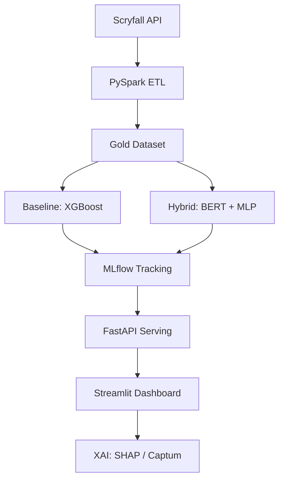
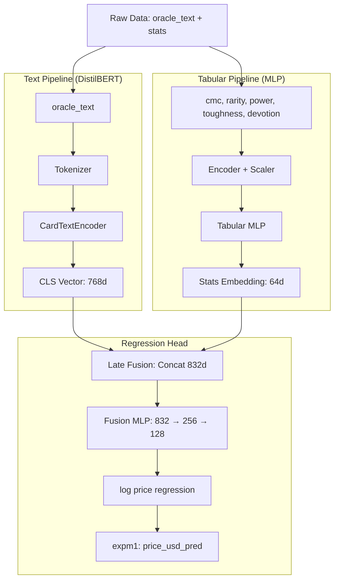

# 🔮 ManaMetrics: The Hybrid Asset Valuator

[](https://www.python.org/downloads/)
[](https://mlflow.org/)
[](https://pytorch.org/)

**ManaMetrics** is a high-end AI showcase designed to predict the market value of Magic: The Gathering assets. It leverages a multi-modal architecture combining tabular data (game statistics) and semantic rule text via Deep Learning.

## 🚀 Key Features

- **Multi-Modal AI**: Fusion of Transformer-based NLP (BERT) for rule text and Multi-Layer Perceptrons for game stats.
- **Big Data Engineering**: Scalable ETL pipeline powered by **PySpark**.
- **Explainable AI (XAI)**: Visual breakdown of price factors using **SHAP** and **Captum**.
- **Full MLOps Lifecycle**: Experiment tracking with **MLflow** and data versioning with **DVC**.
- **Interactive Showroom**: Real-time price inference via a **Streamlit** dashboard.

## 🏗️ Architecture



## 🛠️ Tech Stack

- **Core**: Python 3.11, PySpark
- **Modeling**: PyTorch (Lightning), Transformers, Scikit-Learn, XGBoost
- **XAI**: SHAP, Captum
- **MLOps**: MLflow, DVC, Docker
- **Interface**: FastAPI, Streamlit

## 📁 Project Structure

- `data/`: Raw and processed datasets.
- `models/`: Saved model binaries and weights.
- `notebooks/`: Exploratory Data Analysis and Proof of Concepts.
- `src/`: Modular source code (ETL, Modeling, Serving).
- `tests/`: Automated unit and functional tests.



## 🧪 Methodology & Roadmap

### Phase 0: Data Engineering
*   **Preprocessing**: Dataset cleaning and outlier removal.
*   **Feature Engineering**: Extraction of numeric game statistics and text normalization.
*   **Target Scaling**: Log-transformation of price data for variance stabilization.

### Phase 1: Statistical Baselines (Tabular Only)
*Goal: Establish a performance floor using game statistics.*
*   **Models**: Ridge Regression, Random Forest, XGBoost.
*   **Evaluation**: RMSE, MAPE, and Binned MAPE.
*   **Question**: Do numeric stats alone provide sufficient predictive signal?

### Phase 2: Semantic NLP (Text Only)
*Goal: Isolate the price signal within card oracle text.*
*   **Architecture**: DistilBERT with a custom Regression Head.
*   **Comparison**: Benchmarking against tabular baselines and naïve means.
*   **Question**: Does rule text contain unique valuation data?

### Phase 3: Multi-modal Hybrid Architecture
*Goal: Exploit non-linear interactions between text and stats.*
*   **Components**: Tabular MLP + DistilBERT Encoder.
*   **Fusion**: Late fusion via concatenation and joint MLP processing.
*   **Insight**: Capturing the synergy between game mechanics and card abilities.

### Phase 4: Ablation Studies & Validation
*Goal: Scientific verification of the multi-modal approach.*
*   **Text-only vs. Stats-only**: Validating modality contributions within the hybrid model.
*   **Fusion Sensitivity**: Testing model stability during partial feature dropout.
*   **XAI Analysis**: Using SHAP/Captum to verify feature importance across modalities.

---
## 🧪 Testing & Quality Control

The project includes a comprehensive suite of unit and integration tests to ensure model reliability.

### Running Tests
To run the full test suite, use the following command:
```bash
pytest tests/
```

### Test Coverage
- **ETL (`test_etl.py`)**: Validates the PySpark transformation pipeline.
- **ML Baseline (`test_ml.py`)**: Tests data preprocessing, model comparative study, and binned MAPE metrics.
- **Deep Learning (`test_deep.py`)**: Verifies MTG-specific tokenization and DistilBERT encoder dimensions.
- **Hybrid Fusion (`test_hybrid.py`)**: Ensures the multi-modal fusion logic and forward pass are mathematically correct.

### Continuous Integration
Code quality is enforced using:
- `black`: Code formatting
- `isort`: Import sorting
- `flake8`: Linting
- `pytest`: Automated testing

---
---
## 🛠️ Guide d'Utilisation : Entraînement de A à Z

Ce guide détaille les étapes pour collecter les données, les transformer via le pipeline ETL, et lancer les modèles d'apprentissage.

### 1. Préparation de l'Environnement
Activez le venv et assurez-vous que `JAVA_HOME` pointe vers une installation Java valide (requise pour PySpark).
```bash
source .venv_312/bin/activate
# Sur Mac ARM (Homebrew), JAVA_HOME doit souvent être forcé :
export JAVA_HOME=/opt/homebrew/opt/openjdk@11
export PYTHONPATH=.
```

### 2. Collecte des Données (`src/data/collect.py`)
Télécharge les données brutes depuis l'API Scryfall.
```bash
# Téléchargement par défaut (Oracle Cards - Recommandé pour NLP)
python3 src/data/collect.py --type oracle_cards

# Pour des données plus complètes (toutes les impressions de chaque carte)
python3 src/data/collect.py --type all_cards

# Options disponibles : oracle_cards, unique_artwork, default_cards, all_cards
```
Les fichiers sont sauvegardés dans `data/raw/`.

### 3. Pipeline ETL (`src/data/etl.py`)
Transforme le JSON brut en format Parquet (Gold Layer) optimisé pour le ML via **PySpark**.
```bash
python3 src/data/etl.py --input data/raw/oracle_cards.json --output data/processed/cards.parquet
```
- Effectue le nettoyage (Power/Toughness, prix NULL).
- Feature Engineering (Devotion, Age de la carte, Type).
- Génère automatiquement une documentation du dataset dans `data/processed/dataset_schema.md`.

### 4. Orchestration de l'Entraînement (`src/train.py`)
Utilisez ce script pour lancer les différentes phases de modélisation.

```bash
# A. Étude comparative (XGBoost, Random Forest, Ridge)
# Calcule les SHAP values et affiche un tableau récapitulatif.
python3 src/train.py --baseline

# B. Fine-tuning NLP Standalone (BERT seul)
# Pour entraîner l'encodeur de texte à "comprendre" le langage Magic.
python3 src/train.py --deep --epochs 3

# C. Modèle Hybride FINAL (Texte + Stats)
# Entraîne la fusion multi-modale.
python3 src/train.py --hybrid --epochs 10

# D. Pipeline Complet
python3 src/train.py --all
```

### 5. Analyse des Résultats
- **Console** : Les métriques (RMSE, MAPE) sont affichées en temps réel.
- **Fichiers Modèles** : `models/*.joblib` pour les baselines, `models/*.pt` pour PyTorch.
- **Interprétabilité** : Les fichiers `models/shap_values_*.npy` peuvent être chargés dans un notebook pour visualiser l'importance des features.